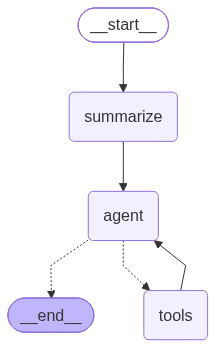
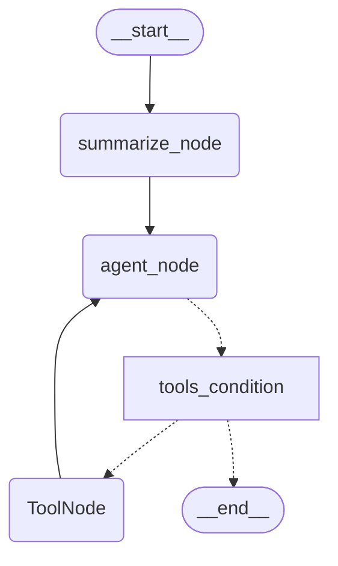

# UCP Portal Assistant

[](https://www.python.org/) [](https://langchain-ai.github.io/langgraph/) [](https://groq.com/) [](https://ntfy.sh) [](https://playwright.dev/) [](https://smith.langchain.com/)

UCP Portal Assistant is an agentic AI system for managing University of Central Punjab (UCP) Student Portal data.

The system connects to the portal using Playwright web automation, caches records in a local SQLite database, and provides an interface via 2-way ntfy push notifications or a terminal CLI.

---

## Table of Contents
- [Architecture Overview](#architecture-overview)
- [Agent Workflow Diagram](#agent-workflow-diagram)
- [Active Model Configuration](#active-model-configuration)
- [Features](#features)
- [Project Directory Map](#project-directory-map)
- [Tool Suite](#tool-suite)
- [Installation & Setup](#installation--setup)
- [Configuration (.env)](#configuration-env)
- [Usage Guide](#usage-guide)
- [Observability & Tracing](#observability)
- [Important Disclaimer](#disclaimer)
- [Azure Cloud Deployment Guide](#azure)
- [Maintenance & Essential Commands](#maintenance)
- [Contributing](#contributing)

---

## Architecture Overview

The system consists of six main components:

1. **Scraper Layer (`ucp_scraper.py`)**: Uses Playwright to log into the UCP Portal and fetch student records (dashboard, timetables, transcripts, course materials, invoices).
2. **Database & Cache Manager (`uni_db_manager.py`)**: Caches portal data in a local SQLite database (`uni_data.db`).
3. **Tool Registry (`ucp_tools.py`)**: Exposes 11 tools with JSON schema docstrings for LLM function calling.
4. **Agent Engine (`uni_agent_ntfy.py` / `uni_agent_test.py`)**: Implements a LangGraph StateGraph workflow with entry-point memory summarization, conditional tool execution (`tools_condition`), ToolNode, and checkpointer state memory (`MemorySaver`).
5. **2-Way Mobile Interface**: Listens on ntfy.sh long-polling JSON streams to send push notification replies.
6. **Proactive Alert Engine (`proactive_alerts.py`)**: Runs an APScheduler background process to monitor upcoming classes and injects push reminders with state directly into the LLM's memory.

---

## Agent Workflow Diagram

### High-Level Graph Flow





### Graph Execution Cycle
1. **User Query**: Received via ntfy.sh or Terminal.
2. **Summarize Node (`summarize`)**: Compresses conversation history when message count exceeds threshold, removing old messages using `RemoveMessage`.
3. **Agent Node (`agent`)**: Injects existing summary into SystemMessage and invokes the bound LLM.
4. **Conditional Router (`tools_condition`)**: Routes to ToolNode if tools are requested, or END if no tool call is needed.
5. **Tool Execution (`tools`)**: Executes the database tool and routes results back to agent.

---

## Active Model Configuration

The project's LLM bindings are managed in `models.py`.

- **Currently Active Provider**: Groq API (`ChatGroq`)
- **Currently Active Model**: `openai/gpt-oss-120b`

You can switch models in `models.py` by changing the provider parameter:
```python
# The bot explicitly uses Groq as the fast LLM inference provider
llm, llm_with_tools = get_llm(provider="groq")
```

---

## Features

- **2-Way Push Communication**: Receive push notifications and send replies using ntfy.
- **Proactive Background Alerts**: Uses `APScheduler` to push class reminders 5 minutes before they start and asks for feedback exactly when they finish.
- **State Injection**: Proactive alerts are injected directly into the LLM's checkpointer memory so the AI remembers the context when you reply.
- **Memory Pruning**: Automatic conversation summarization for long threads.
- **Lightning Fast Inference**: Powered by Groq's LPU inference engine for near-instant responses.
- **Mobile File Attachments & Caching**: Downloads course materials to the server, caches them to save bandwidth, and pushes them directly to your phone as native file attachments!

---

## Project Directory Map

```
UCP-Portal-Assistant/
├── .env                  # Environment configuration template
├── .gitignore            # Git exclusion rules
├── agent_graph.png       # Workflow graph diagram
├── ucp_tools.py          # 11 UCP database tools
├── prompts.py            # System prompts & summary templates
├── models.py             # LLM provider factory & tool bindings
├── uni_agent_ntfy.py     # 2-Way Mobile Push Agent
├── uni_agent_test.py     # Terminal Sandbox CLI
├── ucp_scraper.py        # Playwright Portal Scraper
├── uni_db_manager.py     # SQLite Database Manager
└── README.md             # Documentation
```

---

## Tool Suite

| Tool Name | Purpose |
| :--- | :--- |
| `get_student_dashboard` | Returns Roll Number, Department, CGPA, Credits, and Enrolled Courses. |
| `get_full_timetable` | Returns weekly schedule with start/end times, instructor names, and rooms. |
| `get_academic_history` | Returns past transcripts and course grades. |
| `get_full_course_details` | Returns course outline, attendance logs, gradebooks, and assignment due dates. |
| `download_file` | Downloads course materials to local storage. |
| `get_invoices` | Returns financial invoices, payable amounts, and payment status. |
| `get_notifications` | Returns portal alerts and announcements. |
| `get_exam_datesheet` | Returns exam dates, times, and venues. |
| `get_detailed_profile` | Returns profile, address, and guardian information. |
| `get_current_time` | Returns local timestamp and day of week. |
| `sync_university_data` | Triggers a fresh live portal re-scrape. |

---

## Installation & Setup

### Prerequisites
- Python 3.10+
- Playwright Chromium

### Installation Steps

1. **Fork the Repository:** Click the "Fork" button at the top right of this repository to create your own copy (this is required for the auto-updater CD pipeline to work for your own server).
2. **Clone your Fork:**
```bash
git clone https://github.com/<your_github_username>/ucp-portal-assistant.git
cd ucp-portal-assistant
```

3. **Install Dependencies:**

**For Mac/Linux:**
```bash
python3 -m venv .venv
source .venv/bin/activate
pip install -r requirements.txt
playwright install chromium
```

**For Windows:**
```powershell
python -m venv .venv
.venv\Scripts\activate
pip install -r requirements.txt
playwright install chromium
```

---

## Configuration (.env)

Create a `.env` file in the project root:

```env
# UCP Portal Credentials
UCP_EMAIL=your_student_email_here
UCP_PASSWORD=your_portal_password_here

# LLM Provider API Keys
GROQ_API_KEY=your_groq_api_key_here

# Mobile Push Notification Settings (ntfy.sh)
NTFY_TOPIC=your_ntfy_topic_here
BOT_TITLE="your_bot_title_here"
BOT_TAG=your_bot_tag_here

# LangSmith Observability & Tracing (Optional)
LANGCHAIN_TRACING_V2=true
LANGCHAIN_ENDPOINT=https://api.smith.langchain.com
LANGCHAIN_API_KEY=your_langchain_api_key_here
LANGCHAIN_PROJECT=your_project_name_here
```

---

## Usage Guide

### 1. Mobile Push Agent (`uni_agent_ntfy.py`)

```bash
python uni_agent_ntfy.py
```

- Subscribe to your ntfy topic on your mobile device.
- Send messages via ntfy to communicate with the agent.

### 2. Terminal CLI (`uni_agent_test.py`)

```bash
python uni_agent_test.py
```

Runs the CLI with token streaming.

---

<a id="observability"></a>
## 📊 Observability & Tracing

LangSmith tracing is seamlessly integrated. Set `LANGCHAIN_TRACING_V2=true` in your `.env` to monitor agent step tracking, tool execution latency, and overall LLM performance under your configured LangChain project name.

---

<a id="disclaimer"></a>
## ⚠️ Important Disclaimer

**This is an unofficial, community-driven project.** 
It is not affiliated with, endorsed by, or connected to the University of Central Punjab (UCP) in any way. 

- **Privacy First:** Your university credentials (`UCP_EMAIL`, `UCP_PASSWORD`) never leave your local machine. They are exclusively used by the local Playwright instance to authenticate directly with Microsoft SSO.
- **No Cloud Database:** All scraped data is stored locally on your machine in `uni_data.db`.
- **Use at Your Own Risk:** This tool automates portal interactions. The developers are not responsible for any account locks, missed deadlines, or portal availability issues.


<a id="azure"></a>
# ☁️ Azure Cloud Deployment Guide

This guide covers exactly how to deploy the **UCP Portal Assistant** to run 24/7 in the cloud, completely for free using the **GitHub Student Developer Pack** and **Microsoft Azure**.

---

## 1. Create a Free Azure Virtual Machine
Since the bot uses Playwright (a headless browser) and WebSockets (for real-time push notifications), serverless platforms like Vercel or AWS Lambda will not work. A raw Linux Virtual Machine (VM) is required.

1. Go to the [GitHub Student Developer Pack](https://education.github.com/pack) and activate the **Microsoft Azure** offer to get $100 in free credit and free 12-month services (no credit card required).
2. Log into the [Azure Portal](https://portal.azure.com/) using your university email (`@ucp.edu.pk`).
3. Search for **Virtual machines** and click **Create -> Azure virtual machine**.

### Virtual Machine Settings:
- **Subscription:** Azure for Students
- **Resource group:** Create a new one (e.g., `ucp-bot-rg`)
- **Virtual machine name:** `ucp-bot-server`
- **Region:** **IMPORTANT:** Azure heavily restricts student accounts. If you get a `RequestDisallowedByAzure` error, you must select a region allowed by your specific policy. Safe bets are often **Central India**, **UAE North**, **Central US**, or **West Europe**.
- **Availability options:** `No infrastructure redundancy required` (This unlocks the free tier sizes).
- **Image:** Ubuntu Server 24.04 LTS
- **Size:** Click "See all sizes" and search for **`B1`**. Select **`Standard_B1s (free services eligible)`**.
- **Authentication type:** Password (create a username and a strong 12-character password).
- **Inbound port rules:** Allow selected ports -> **SSH (22)**.

Click **Review + create** and then **Create**. Wait 2-3 minutes for deployment to finish, click **Go to resource**, and copy your **Public IP address**.

---

## 2. Connect to the Server
Open your laptop's terminal (Command Prompt, PowerShell, or Mac Terminal) and SSH into the new server:

```bash
ssh your_username@YOUR_PUBLIC_IP_ADDRESS
```
*(Type `yes` if prompted, then enter your password. The password will be invisible as you type it).*

---

## 3. Install the Bot
Once logged into the server, run these commands one by one to download the code and install dependencies:

```bash
# 1. Update the Linux server
sudo apt update && sudo apt upgrade -y

# 2. Download the project code from GitHub
git clone https://github.com/<your_github_username>/ucp-portal-assistant.git
cd ucp-portal-assistant

# 3. Install Python virtual environment tools
sudo apt install python3-venv -y

# 4. Create and activate a clean Python environment
python3 -m venv .venv
source .venv/bin/activate

# 5. Install the required Python packages
pip install -r requirements.txt

# 6. Install Playwright and its Linux OS dependencies
playwright install chromium
playwright install-deps

# 7. Set the server timezone to your local time (e.g., Pakistan)
sudo timedatectl set-timezone Asia/Karachi
```

---

## 4. Add Your Passwords (.env)
Because your GitHub repository is public, it doesn't contain your `.env` file for security reasons. You must recreate it on the server:

1. Open the file editor in the terminal:
   ```bash
   nano .env
   ```
2. Paste all of your secrets (copy them from your local laptop's `.env` file):
   ```env
   UCP_EMAIL="your_email@ucp.edu.pk"
   UCP_PASSWORD="your_portal_password"
   GROQ_API_KEY="gsk_..."
   NTFY_TOPIC="your_secret_topic"
---

## 5. Bypass Microsoft Security (Optional - "Pass-the-Cookie" Trick)
*Note: Try running the bot normally first. ONLY do this step if the bot throws an "Authentication loop detected" or "Session expired" error.*

Because your Azure server is in a massive data center (e.g., Central India), Microsoft 365 might flag the headless login attempt as a "suspicious sign-in" and throw a security block or MFA challenge, which breaks the headless browser. 

To bypass this professionally, we inject your local, pre-authenticated session into the server:
1. On your **local laptop**, open `portal_session.json` in your code editor and copy ALL the text.
2. In your **server terminal**, open the session file (if it exists, delete its current contents):
   ```bash
   nano portal_session.json
   ```
3. Paste your copied local session into the terminal.
4. Save and exit (**`CTRL + X`**, then **`Y`**, then **`Enter`**).

*(Note: Microsoft uses rolling sessions, so this injected cookie should stay valid for the entire semester as long as the bot remains active).*

---

## 6. Run the Bot Forever (24/7)
If you simply run the script normally, it will shut down as soon as you close your laptop. To keep it running forever, we use a background session manager called `tmux`.

```bash
# 1. Start a new background session named "ucpbot"
tmux new -s ucpbot

# 2. Run the agent
python uni_agent_ntfy.py
```

Wait until the terminal says `[Connected] Active & listening...`. 
Now, press **`CTRL + B`**, let go of both keys, and then press **`D`**. 

**Your bot is now running in the background!** You can close your laptop entirely, disconnect from WiFi, and the bot will stay alive 24/7 on the Azure server.

---

<a id="maintenance"></a>
## 🛠️ Maintenance & Essential Commands

### How to restart the bot or view logs:
If you need to see what the bot is doing, or if you need to restart it:
1. SSH into the server: `ssh username@IP_ADDRESS`
2. Re-attach to your background session:
   ```bash
   tmux attach -t ucpbot
   ```
3. To stop the bot, press `CTRL + C`.
4. Run it again with `python uni_agent_ntfy.py`.
5. Detach again with `CTRL + B` then `D`.

### How to update your code automatically (Continuous Deployment):
Instead of logging in to pull code manually every time you push to GitHub, we created an `auto_updater.sh` script that does it for you. You just need to activate it once using a Linux cron job:
1. SSH into the server: `ssh username@IP_ADDRESS`
2. Open the cron editor: `crontab -e` *(Select `nano` if it asks you to choose an editor).*
3. Scroll to the very bottom and add this exact line:
   ```bash
   * * * * * /home/your_username/ucp-portal-assistant/auto_updater.sh >> /home/your_username/ucp-portal-assistant/updater.log 2>&1
   ```
4. Save and exit (`CTRL+X`, `Y`, `Enter`). 

Now, every 60 seconds, the server will check GitHub. If you pushed new code, it will automatically pull it, install any new dependencies, and restart your bot!

### How to temporarily stop the server:
The `B1s` server is extremely cheap and easily covered by your $100 student credit. However, if you want to turn it off to save credits:
1. Go to the **Azure Portal** in your web browser.
2. Go to the Virtual Machine overview page.
3. Click the **Stop** button at the top to deallocate it.
*Note: When you click **Start** later, Azure might assign a new Public IP address. You will also have to SSH back in and re-run the `tmux` commands, as turning off the server kills all running programs.*

---

<a id="contributing"></a>
## 🤝 Contributing

Contributions, issues, and feature requests are welcome!
Feel free to check the [issues page](../../issues) if you want to contribute.

1. Fork the Project
2. Create your Feature Branch (`git checkout -b feature/AmazingFeature`)
3. Commit your Changes (`git commit -m 'Add some AmazingFeature'`)
4. Push to the Branch (`git push origin feature/AmazingFeature`)
5. Open a Pull Request

---
*Built with ❤️ using LangChain and LangGraph.*
